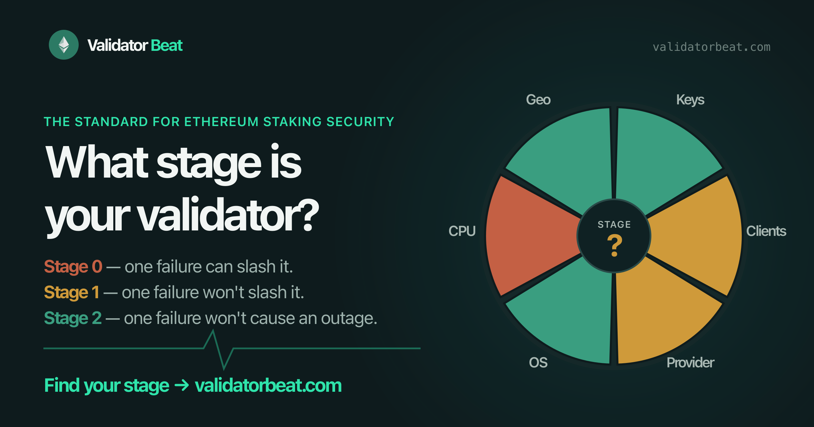

<div align="center">
  <a href="https://validatorbeat.com"></a>
  <h1>Validator Beat</h1>
  <p><strong>Six questions. Six slices. One Stage.</strong><br/>A neutral, public-good self-assessment of how resilient an Ethereum validator setup really is.</p>
  <p>
    <a href="https://validatorbeat.com/assess/"></a>
  </p>
  <p>
    <a href="https://github.com/ObolNetwork/validator-beat/actions/workflows/ci.yml"></a>
    <a href="./LICENSE"></a>
    <a href="https://validatorbeat.com/methodology/"></a>
  </p>
</div>

---

Staking earns a few percent a year. One bad day can take far more. Validators rarely fail because of something exotic — they fail at a **single point of failure** nobody wrote down: one person with the mnemonic, one supermajority client, one cloud account, one distro, one CPU architecture, one country's power grid.

Validator Beat makes those single points of failure legible. Answer six questions, get a pizza with six colored slices, and a Stage anyone can read in five seconds.

## The stages

| | Stage | Meaning | Rule |
|---|---|---|---|
| 🔴 | **Stage 0 · Getting started** | One failure could get you slashed. | A safety slice is red or *not sure* |
| 🟡 | **Stage 1 · Safety** | No single failure can get you slashed. | Every safety slice is green or yellow |
| 🟢 | **Stage 2 · Liveness** | No single failure can slash you *or* take you offline. | All six slices green |

## The six slices

| Slice | Guards against | Kind |
|---|---|---|
| **Key Custody** | One party, machine, or custodian holding enough key material to sign | Safety |
| **Client Diversity** | Following a buggy supermajority execution or consensus client onto the wrong chain | Safety |
| **Provider Diversity** | One hosting provider's outage taking you offline | Liveness |
| **OS Diversity** | One distro's supply chain reaching enough key shares to sign | Safety |
| **CPU Architecture** | One ISA-level flaw reaching enough key shares to sign | Safety |
| **Geographic Diversity** | One country or region's outage taking you offline | Liveness |

Colors mean one thing everywhere: 🔴 **red** — one failure could get you slashed; 🟡 **yellow** — one failure could take you offline (or a safety gap is only partly closed); 🟢 **green** — no single failure can do either. Bands follow the threshold-signing math: distributed validators typically need ⅔ of key shares to sign, so a single point holding ⅔ or more is red and ⅓ or less is green. Every question also offers ⚪ **Not sure**, treated as an open gap — one you can't verify is closed has to be assumed open. Liveness matters more than it used to: under [EIP-7716](https://eips.ethereum.org/EIPS/eip-7716), correlated downtime could cost far more than it does today (see the [downtime calculator](https://validatordowntime.obol.org)).

The full rationale, nuances, and known limits are in the [methodology](https://validatorbeat.com/methodology/).

## Share it

Every result is a six-letter code, one letter per slice — `G`reen, `Y`ellow, `R`ed, or `U` for not sure — so a result is just a URL:

```
https://validatorbeat.com/GGGRGG/?n=Ethereum%20Foundation's%20cluster
```

- **Link previews** — each code has a pre-rendered Open Graph card, so links unfurl with the pizza in X, Slack, Discord, and Telegram.
- **Head to head** — add `&vs=<CODE>&vn=<name>` to show two results side by side. Anyone opening a shared result can take the assessment themselves and compare.
- **Badge** — drop a live stage badge into your docs, README, or website:

  ```markdown
  [](https://validatorbeat.com/GYYGGY/)
  ```

## Private by construction

There is no backend. The site is a static export on GitHub Pages; scoring runs in your browser and nothing is submitted, stored, or tracked. Every one of the 1,296 possible results is a pre-built page. AI agents can run the same assessment from [`skill.md`](https://validatorbeat.com/skill.md) and [`llms.txt`](https://validatorbeat.com/llms.txt), both generated from the rubric so they can't drift.

## Improve the rubric

The rubric is meant to be challenged. It lives in one place — [`lib/rubric/`](./lib/rubric) for stages, slices, and tips, and [`lib/assessment/questions.ts`](./lib/assessment/questions.ts) for question copy — and is fully unit-tested. Open an issue or PR with the scenario the current bands get wrong.

For the operational controls behind each slice, see [ValOS, the Validator Operations Standard](https://lidofinance.github.io/valos/valos-spec.html).

## Develop

Requires **Node.js 24+** (see [`.nvmrc`](./.nvmrc)).

```bash
yarn install
yarn dev        # http://localhost:3000
yarn test       # rubric unit tests
yarn build      # OG images + badges + agent files → static export in out/
```

Deployment, link-preview debugging, and theming notes are in [`docs/DEVELOPMENT.md`](./docs/DEVELOPMENT.md).

## Credits

Built by [Obol](https://obol.org), in partnership with [Lido](https://lido.fi). Licensed under [Apache 2.0](./LICENSE).
