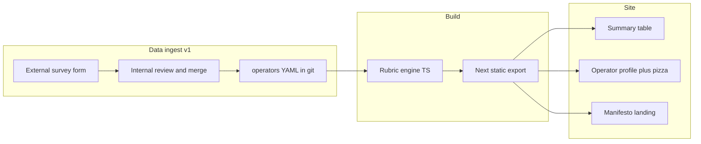

# Validator Beat — Project Setup & Implementation Plan

> Greenfield Validator Beat as a static Next.js site aligned with dv-launchpad (Next 15, obol-ui, TypeScript), implementing the v1.2 six-slice rubric and Stage 0–2 model, with operator data ingested via external survey + internal merge into versioned YAML. UX patterns borrow from sortable summary tables and criteria-driven per-entity profiles (see [References](#references)—external sites only, not product naming).

---

## Decisions (locked in)

| Topic | Choice |
|-------|--------|
| Survey → site data | **External form** (Typeform/Google) + internal admin merges validated data into the repo |
| Scoring framework | **DRAFT Validator Beat v1.2** — **6 slices**, Stage 1/2 matrix |

---

## What you are building

**Product:** **Validator Beat** — public transparency dashboard for Ethereum node operators (summary list + per-operator profiles with stage and six-slice risk pizza).

**Early manifesto prototype:** [stately-bienenstitch demo](https://stately-bienenstitch-8e3cfc.netlify.app/) — landing copy, framework teaser, mock operator table (Kraken, Blockdaemon, Non-Disclosure rows, etc.). Copy and visuals will be ported into this repo; branding stays **Validator Beat** only.

**UX patterns (not product names):**

- **Summary list** — sortable table, risk indicators, stage column, filters, drill-down to detail
- **Operator profile** — criteria-driven stages, per-entity report page, open contribution via PRs

**Relationship to valOS:** valOS = deep control catalog; Validator Beat = **who** + **30-second read** (stage + pizza). Slice rubrics should map to valOS controls over time.



---

## Stack recommendation (with deliberate slimming)

**Use dv-launchpad’s core stack, not its full Web3 surface.**

| Layer | Use from dv-launchpad | Skip for Validator Beat v1 |
|-------|----------------------|------------------------------|
| Framework | **Next.js 15** (Pages Router for team parity) | App Router migration |
| UI | **@obolnetwork/obol-ui** (TableV3, layout tokens, `globalCss`) | RainbowKit, Wagmi, obol-sdk, Splits |
| Language | **TypeScript 5.9**, path aliases | Apollo/GraphQL unless needed later |
| Build | **`output: "export"`** static site | Wallet-connect flows |
| Package mgr | **Yarn 1.x** | — |
| Quality | ESLint, Prettier, Husky, Jest for rubric unit tests | Playwright until critical paths exist |
| Deploy | **Deferred** — static `out/` is CI-built; hosting added later | Netlify/CF until we choose |

**Why not WalletBeat’s Astro stack?** Obol already ships production UIs on Next + obol-ui. Reusing `TableV3` patterns from dv-launchpad is faster for the summary table.

**Why static data-in-repo?** Live indexers and continuous updates are out of scope for v1; **point-in-time + survey** is enough until beacon/API automation is scoped.

**Reference repo:** `~/Desktop/dv-launchpad` — `package.json`, `next.config.js`, `pages/_app.tsx`, `containers/explore/OperatorsTable.tsx`.

---

## Terms (plan checklist)

### Rubric engine (`lib/rubric`)

TypeScript code that **scores each operator** from survey/YAML inputs using the v1.2 rules: six slices → green/yellow/red per slice, then overall **Stage 0 / 1 / 2** (or **Non-Disclosure**). Pure functions + Jest tests so the site and CI never disagree on colors or stage.

Example: given “largest custodian holds 70% of keys” → Key Custody slice is **red**; combined with other slices, compute whether the operator meets Stage 1 minimums.

### Zod (`lib/schemas`)

A small **validation library** for TypeScript. We use it to check each `data/operators/*.yaml` file **before merge**: required fields, numbers in 0–1 range, valid enums. If YAML is malformed, CI fails the PR—same idea as a form that won’t submit until fields are valid.

---

## Framework spec (v1.2 — source of truth)

### Stages (cumulative: Stage 2 implies Stage 1)

| Stage | Meaning | Signing-material exposure |
|-------|---------|---------------------------|
| **Stage 1** | Slashing-resistant | No single point of failure exposes **>⅔** of signing material |
| **Stage 2** | Downtime-resistant | No single point of failure exposes **>⅓** of signing material; infra SPOF also cannot take validators offline |

**Stage 0:** Listed but does not meet Stage 1 minima on slices.

**Non-Disclosure:** Survey not completed — pizza **fully red** (per manifesto); distinct from Stage 0.

### Minimum slice colors per stage

| Slice | Stage 1 min | Stage 2 min |
|-------|-------------|-------------|
| Key Custody | Yellow | Green |
| Client Diversity | Yellow | Green |
| Infrastructure Diversity | Yellow | Green |
| OS Diversity | Yellow | Green |
| CPU Architecture Diversity | Yellow | Green |
| Geographic Diversity | Yellow | Green |

An operator can be Stage 0 with some green slices.

### Six slices — rubric colors (implement as pure functions + tests)

1. **Key Custody** — largest custodian share (runtime **+ backup**): Green ≤⅓, Yellow ⅓–⅔, Red >⅔
2. **Client Diversity** — Green: ≥3 independent clients + cross-client attestation consensus + combined network share ≤66%; Yellow: ≥3 clients + consensus; Red: single-client or multi-client without consensus
3. **Infrastructure Diversity** — largest provider: Green <33%, Yellow 33–66%, Red >66%
4. **OS Diversity** — distinct Linux/Unix distros: Green ≥3, Yellow 2, Red 1
5. **CPU Architecture** — ISAs (x86-64, ARM64, RISC-V): Green ≥3, Yellow 2, Red 1
6. **Geographic Diversity** — largest region: Green <33%, Yellow 33–66%, Red >66%

**Note:** The public manifesto site still shows **4 pillars** and a different geo threshold (“above one-half”). **Update public copy** to match v1.2 before launch.

**Future:** Client Diversity Green can **drift** to Yellow when network client shares change—automate post-v1, not blocking launch.

---

## Information architecture (pages)

| Route | Purpose |
|-------|---------|
| `/` | Manifesto + framework + CTA to survey |
| `/operators` | Summary table (default sort: ETH secured desc) |
| `/operators/[slug]` | Profile: stage, pizza, slice breakdowns, links |
| `/methodology` | Stages, slices, thresholds (from v1.2) |
| `/survey` | Redirect/embed external form |

**Summary table columns (v1):** `#`, Name (logo), **Risks** (mini pizza or 6-dot row), Stage, Total ETH Secured.

**Filters (phase 2):** Stage, Non-Disclosure, slice color (e.g. “any red slice”).

---

## Data model & survey workflow

### Operator record (`data/operators/*.yaml`)

```yaml
slug: kraken
name: Kraken
website: https://...
logo: /images/operators/kraken.svg
ethSecured: 1430029          # manual v1; beacon API later
surveyStatus: complete       # complete | non_disclosure
surveySubmittedAt: 2026-06-01
slices:
  keyCustody:
    largestCustodianShare: 0.25
    notes: "..."
  clientDiversity:
    clients: [lighthouse, teku, nimbus]
    crossClientConsensus: true
    combinedNetworkShare: 0.45   # optional until automated
  infrastructure:
    breakdown: { aws: 0.2, bare_metal: 0.8 }
  os:
    breakdown: { ubuntu: 0.6, nixos: 0.4 }
  cpu:
    breakdown: { x86_64: 0.9, arm64: 0.1 }
  geography:
    breakdown: { US: 0.4, EU: 0.35, APAC: 0.25 }
```

### Pipeline

1. **External form** — Typeform/Google Form mirroring survey fields (structured sections per slice).
2. **Internal admin** — Export CSV → map to YAML → open PR.
3. **CI validation** — Zod schema + rubric engine computes `sliceColors`, `stage`; fail PR on invalid data.
4. **Build** — `getStaticPaths` for all operators; regenerate summary.

**Non-disclosure:** Seed known operators with `surveyStatus: non_disclosure` → all slices **red**, stage **Non-Disclosure**.

---

## Repo scaffold

```
validator-beat/
├── docs/
│   └── PLAN.md                 # this file
├── data/operators/             # YAML per operator
├── content/methodology/        # MDX optional
├── lib/rubric/                 # Pure scoring + stage computation
├── lib/schemas/                # Zod operator schema
├── components/
│   ├── pizza/                  # 6-slice SVG
│   ├── operators/              # Table rows, risk cells
│   └── layout/                 # Nav, footer
├── pages/
│   ├── index.tsx               # Manifesto
│   ├── operators/index.tsx
│   └── operators/[slug].tsx
├── scripts/
│   ├── validate-operators.ts
│   └── import-survey-csv.ts
├── public/images/operators/
├── next.config.js
├── package.json
└── .github/workflows/ci.yml
```

### Bootstrap steps

1. Scaffold Next 15 Pages Router + static export + obol-ui (no Wagmi).
2. Pin `@obolnetwork/obol-ui@1.1.19`, React 19 (match dv-launchpad).
3. Implement rubric + Jest fixtures from v1.2.
4. Port manifesto from early prototype; **replace 4-pillar section with 6-slice framework**.
5. Seed ~10 mock operators from prototype table.
6. Build `PizzaChart` (accessible SVG, green/yellow/red).
7. Wire `NEXT_PUBLIC_SURVEY_URL` to external form.

---

## Deployment (later — not in scaffold)

v1 build output is a fully static folder: `yarn build` → **`out/`**. No server required.

**Planned default (when ready):** [GitHub Pages](https://pages.github.com/) from `main` (or `gh-pages` branch), serving `out/` via GitHub Actions. Fits “data in git, static HTML” and keeps hosting in-repo.

**Alternatives (document only):** Netlify, Cloudflare Pages, or any static host — add `netlify.toml` or equivalent only when chosen.

**Checklist when deploying:**

- [ ] GitHub Actions workflow: `yarn build` → upload `out/` to Pages (or use `peaceiris/actions-gh-pages`)
- [ ] Set `NEXT_PUBLIC_SITE_URL` to the Pages URL (or custom domain)
- [ ] Optional: `basePath` in `next.config.js` if serving from a project subpath (`/validator-beat/`)

---

## UI components

| Component | Source |
|-----------|--------|
| Summary table | obol-ui `TableV3` (dv-launchpad `OperatorsTable` pattern) |
| Stage badge | obol-ui `Badge` or custom (Stage 0, 1, 2, Non-Disclosure) |
| Pizza | **New** — 6 segments from rubric output |
| Metric header | Optional `MetricWidget` |
| Layout / nav | No wallet button |

**Branding:** Manifesto aesthetic + obol-ui tokens for tables/spacing—not a Launchpad clone.

---

## Phased delivery

### Phase 0 — Foundation (week 1)

- Repo scaffold, CI, rubric engine + tests, `/methodology`
- Manifesto landing + survey link

### Phase 1 — MVP dashboard (week 2–3)

- `/operators` summary + `/operators/[slug]` with pizza
- Seed prototype operators + non-disclosure rows
- Admin script: CSV → YAML

### Phase 2 — Survey ops (ongoing)

- Finalize form fields aligned to YAML schema
- Internal review checklist (optional valOS mapping)
- First real operators via PR

### Phase 3 — Enriched data (post-v1)

- Automate `ethSecured` (beacon / third-party APIs)
- Client network share drift job
- Filters, search, OG images
- Contribution guide (GitHub PRs)

---

## Risks and mitigations

| Risk | Mitigation |
|------|------------|
| Manifesto vs v1.2 mismatch | Single `lib/rubric` source; update landing copy early |
| obol-ui missing pizza | Custom SVG; extend obol-ui later if needed |
| Survey data quality | Admin review + Zod CI; publish methodology |
| Internal PDF marked confidential | Ship only **public** rubric on `/methodology` |

---

## Success criteria (v1 launch)

- [ ] Static site deploys from `main` with validated operator YAML
- [ ] Summary table: sort, stage, risks, ETH secured
- [ ] Every operator profile: **6-slice pizza** + computed stage per v1.2
- [ ] Non-disclosure operators: **all-red** pizza
- [ ] Survey CTA works; ≥1 real operator via form → admin → PR

---

## Implementation checklist

- [x] **scaffold-next-obol-ui** — Next 15 Pages Router, static export, obol-ui, TS aliases, CI (lint + test + build)
- [ ] **rubric-engine** — `lib/rubric` from v1.2 (6 slices, stage matrix, non-disclosure) + Jest fixtures
- [ ] **data-schema-pipeline** — Zod operator YAML schema, `validate-operators`, `import-survey-csv`
- [ ] **pages-manifesto-operators** — `/`, `/operators`, `/operators/[slug]` (TableV3 + pizza)
- [ ] **methodology-survey** — `/methodology`; `NEXT_PUBLIC_SURVEY_URL`
- [ ] **seed-deploy** — Seed prototype operators; document survey→PR runbook
- [ ] **deploy-gh-pages** — GitHub Actions → publish `out/` to GitHub Pages (deferred)

---

## References

- Early manifesto prototype: https://stately-bienenstitch-8e3cfc.netlify.app/
- External UX reference (summary table patterns): https://l2beat.com/scaling/summary
- External UX reference (per-entity stages): https://beta.walletbeat.eth.limo/
- Internal spec: DRAFT Validator Beat (v1.2) PDF
