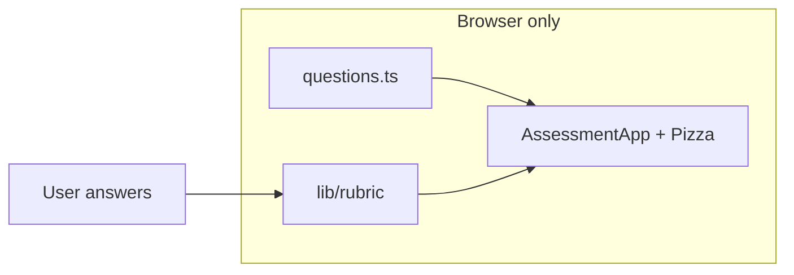

# Validator Beat — Project Plan (v0.1)

> **Validator Beat v0.1** is a client-side self-assessment: six banded questions, live six-slice pizza, Stage 0–2 rollup, shareable result code. Nothing is submitted or stored. Design source: `design_handoff_validator_beat` (ported to Next.js 15 + TypeScript).

---

## Decisions (locked in)

| Topic | Choice |
|-------|--------|
| v0.1 product | **In-app self-assessment** (not external Typeform) |
| Scoring | **Banded answers** → slice color → stage (`lib/rubric`, v0.1 rules) |
| Operator directory | **Deferred** (v1.2 YAML registry + summary table later) |
| Deploy | **Deferred** — static `out/`; GitHub Pages when ready |

---

## v0.1 product

Single-page assessment at `/`:

- **Intro** → **6 questions** (420ms auto-advance) → **Results** + share modal
- Persistent **pizza** panel (right column; top on mobile &lt;880px)
- **Methodology** at `/methodology/`
- Share link: `/GYRYGG?n=Name` (729 static pages; `?n=` optional, not in OG preview)

### Stage rules (v0.1)

| Stage | Rule |
|-------|------|
| **0** | Any red slice |
| **1** | No reds, not all green |
| **2** | All six green |

### Six slices

Key Custody, Client Diversity, Infrastructure, OS, CPU Architecture, Geographic — see `/methodology/`.

**Premise:** Four liveness slices assume per-validator **DVT / multiplexer** (nodes split duties).

---

## Architecture



No API, no database, no operator YAML in v0.1.

---

## Repo layout (v0.1)

```
validator-beat/
├── styles/                  # Handoff CSS tokens + layout
├── lib/
│   ├── rubric/              # Scoring engine + tests
│   ├── assessment/questions.ts
│   └── confetti.ts
├── hooks/useAssessment.ts
├── components/
│   ├── assessment/          # Intro, Question, Results, shell
│   └── pizza/Pizza.tsx
├── pages/
│   ├── index.tsx            # Assessment
│   ├── methodology.tsx
│   └── operators/index.tsx  # Redirect → /
└── docs/PLAN.md
```

---

## Stack

| Layer | Choice |
|-------|--------|
| Framework | Next.js 15 Pages Router, `output: "export"` |
| Language | TypeScript 5.9 |
| Styling | `@obolnetwork/obol-ui` Stitches (`components/assessment/stitches.ts`) + `theme-tokens.css` |
| Tests | Jest (`lib/rubric`) |
| UI kit | `@obolnetwork/obol-ui` (Button, Box, Text, Stitches styled components) |
| Theme | [`styles/theme-tokens.css`](styles/theme-tokens.css) — editable palette (Lido forum–aligned) |

---

## Deferred: operator registry phase

Future work (DRAFT Validator Beat **v1.2**):

- `data/operators/*.yaml`, Zod CI, admin merge pipeline
- `/operators` summary table (obol-ui TableV3)
- v1.2 stage matrix (per-slice minimums vs v0.1 rollup)
- Automate `ethSecured`, client share drift

---

## Deployment (later)

- `yarn build` → `out/`
- GitHub Pages + optional custom domain
- Set `NEXT_PUBLIC_SITE_URL` for share links and OG (future)

---

## Open questions

1. Per-validator vs fleet-level wording for liveness slices
2. Client diversity copy validation with operators
3. `/r/[code]` OG preview images (post–v0.1)
4. Download-image for share card

---

## Implementation checklist

- [x] scaffold-next-obol-ui
- [x] plan-v01-handoff
- [x] rubric-v01
- [x] questions-v01
- [x] styles-v01
- [x] assessment-ui
- [x] methodology-v01
- [x] cleanup-routes
- [ ] deploy-gh-pages (deferred)

---

## References

- Design handoff: `design_handoff_validator_beat/`
- Internal spec (future registry): DRAFT Validator Beat v1.2 PDF
